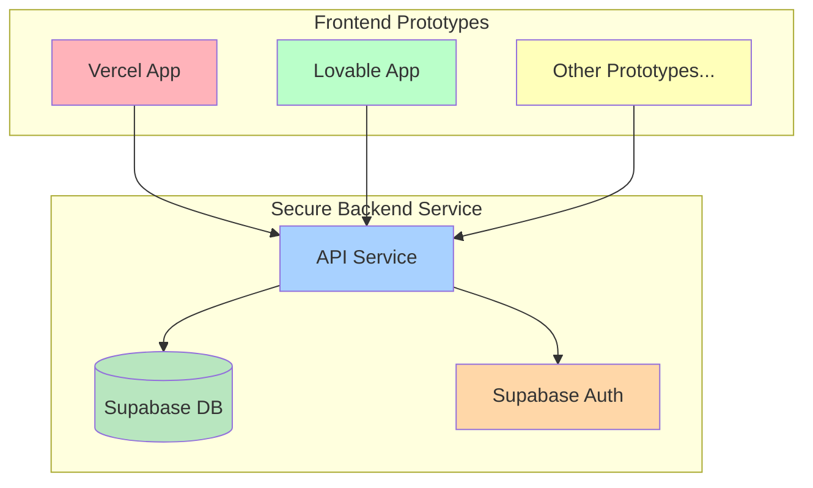

# Prototype System Overview

## Problem

With emerging technologies in AI changing so rapidly, we want to allow rapid experimentation in a real educational environment. New tools
like Vercel and Lovable allow for very fast iteration and prototyping; however, these tools are not well suited for managing data privacy,
permissions, reliability, and authentication.

For an organization that may want to move very quickly to test different ideas in real classrooms, they need infrastructure to support it.
One way to support this is to use a secure service for the data storage, expose it via a hardened API, and then build lightweight apps on
top of those services.

## Goals

We want to enable **rapid prototyping of educational products** in a school-based environment, while ensuring fundamental **data security** and **compliance**.  
This system is designed to:

- Accelerate **front-end and dynamic app prototyping** using AI and LLMs (e.g., Lovable, Vercel, Claude Code, etc.).  
- Provide engaging experiences for both **teachers and students**.  
- Ensure **FERPA-compliant handling of student information**.  
- Reduce repeated integration work by offering a **single, consistent data setup** for all prototypes.

---

## Core Principles

1. **One-time integrations**  
   - If a school site uses a given SIS or LMS, we integrate once (likely via **Edlink** or similar).  
   - That data flows into a single, secure service layer.  
   - Each prototype can then securely reuse this data without new integrations.

2. **Long-lived secure service**  
   - Provides the **underlying data layer** (schools, classes, students, and related records).  
   - Handles **authentication/authorization**.  
     - Initially via **Supabase Auth**.  
     - Later can expand to support SSO from educational sources such as Google Classroom, Clever, or use EdLink to connect to a variety of LMS and SIS vendors.

3. **Independent prototype systems**  
   - Each prototype (a classroom assistant, grading dashboard, interactive tool, etc.) can be built however teams prefer:
     - Vibe-coded with **Vercel**.  
     - Stood up as a standalone service on **Railway**.  
     - Generated with **Claude Code** or similar tools.  
   - All prototypes consume the **same secure backend**.

---

## Proposed Architecture

In this repository, we illustrate an example of such an architecture that splits the data from the prototyped frontend. This supports:

### Long-Lived Secure Service
- Stable service exposing a clean API (REST/OpenAPI).  
- Enforces **data access policies** (row-level security, per-user scoping).  
- Stores canonical school/class/student data.  
- Provides an **admin CRUD UI** for safe inspection and management.  
- Central point of integration with SIS/LMS.  

### Prototype Applications
- Built independently, focusing on user experience and rapid iteration.  
- Call the secure service for data and auth, **never directly handle raw SIS/LMS credentials**.  
- Sandbox and production separation enforced.  

---

## Demonstration System

The demonstration system will consist of **three components**:

1. **Standalone Secure Service**  
   - Represents the long-lived backend.  
   - Provides mock school/class/student data.  
   - Exposes APIs and CRUD UI.  
   - Authentication via Supabase.
   - Written in Python (could just as easily be Nest as well)

2. **Vibe-coded App 1 (Vercel)**  
   - A front-end prototype (e.g., audio chatbot using Vercel AI SDK).
   - Uses the secure service API for roster/class data.

3. **Vibe-coded App 2 (Lovable)**  
   - Another prototype UI (e.g., dashboard or student experience).  
   - Also integrates with the secure service API.  

---

## Future Directions

- Add **Edlink integration** for real SIS/LMS data.  
- Expand **SSO options** for school partners.  
- Provide a library/SDK to simplify connecting new prototypes.  
- Add auditing, rate-limits, and monitoring for production readiness.  

---

## Student Sample Data

This project includes a light set of sample data appropriate for playing with a few apps to illustrate the concept. You can use this student, Maya Chen:

  🎓 Maya Chen's Complete Profile

  Login Credentials:
  - Email: student3@demo.test
  - Password: demo123456

  Academic Profile:
  - Grade: 4th (enrolled in both 3rd and 5th grade classes)
  - Math Strengths (A's & B's): 6 assignments with excellent performance
  - Reading Challenges (C's & D's): 4 assignments showing difficulties

  📊 Sample Data Summary

  Students:
  1. Emma Wilson (3rd grade) - student1@demo.test
  2. Ethan Garcia (5th grade) - student2@demo.test
  3. Maya Chen (4th grade, both classes) - student3@demo.test

  Teachers:
  1. Maria Garcia (3rd grade) - teacher1@demo.test
  2. James Thompson (5th grade) - teacher2@demo.test

## Summary

This system separates **stable, secure data services** from **fast, flexible prototyping**.  
By doing so, we can support school partners with real integrations, while still allowing creative teams to experiment rapidly and safely.
